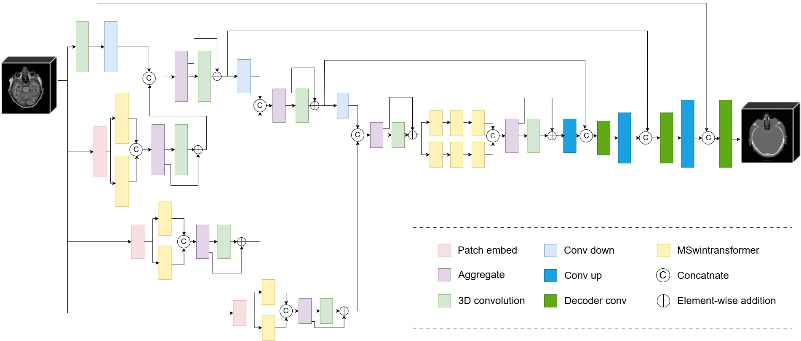
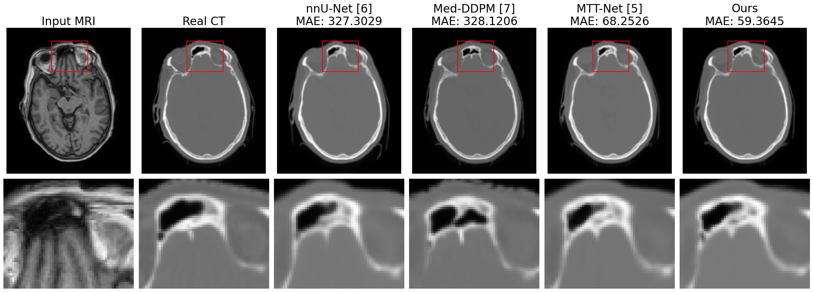
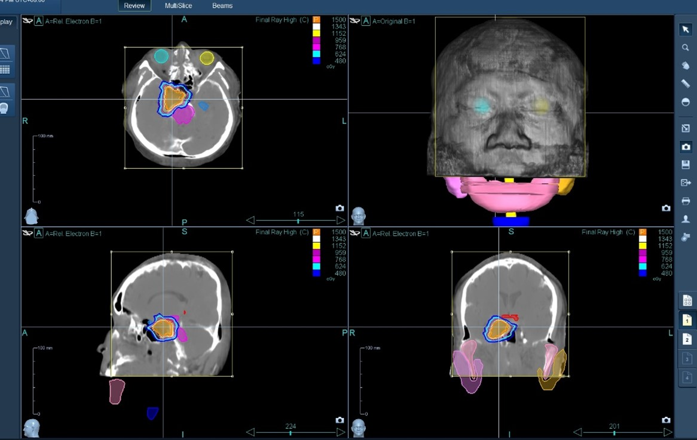

# Parallel Swin Transformer-Enhanced Med2Transformer for 3D MRI-to-CT Synthesis

This repository accompanies the manuscript:

**“Parallel Swin Transformer-Enhanced 3D MRI-to-CT Synthesis for MRI-Only Radiotherapy Planning”**

We present a 3D MRI-to-CT synthesis framework that integrates parallel Swin Transformer branches with convolutional feature extractors to jointly model long-range anatomical structure and high-resolution local detail. The architecture is designed to enhance synthetic CT (sCT) fidelity, geometric consistency, and dosimetric reliability for MRI-only radiotherapy workflows.

The manuscript is currently under review. Code and pretrained model weights will be released soon.

---

## Upcoming Release

- [ ] Full training and inference code  
- [ ] Pretrained model weights  

---

## Method Overview

  

**Figure 1.** Overview of the proposed Parallel Swin Transformer-Enhanced Med2Transformer architecture. Each encoder stage fuses dilated convolutional features with multi-scale shifted-window attention from parallel Swin Transformer branches. This design strengthens anatomical representation and improves MRI-to-CT correspondence in 3D volumes.

---

## Comparison of Synthesized CT Images

  

**Figure 2.** Qualitative comparison of brain MRI-to-CT synthesis across baseline models and the proposed Med2Transformer. Axial samples demonstrate improved cortical bone delineation, enhanced trabecular detail, and closer structural alignment to the reference CT, illustrating the effectiveness of integrating parallel Transformer and convolutional representations.

---

## Dosimetric Evaluation

  

**Figure 3.** Real CT–based CyberKnife dose distribution used as the clinical reference for radiotherapy planning. The plan provides the benchmark dose coverage for the primary target volume (TV) and dose exposure patterns for surrounding organs-at-risk (OARs). This serves as the ground-truth standard for evaluating synthetic CT dose accuracy.

  

**Figure 4.** Synthetic CT–based CyberKnife dose distribution generated using Med2Transformer. The sCT-based plan demonstrates close agreement with the real CT plan (Figure 3), maintaining accurate target volume (TV) dose coverage and consistent organs-at-risk (OAR) dose behavior. Dose deviations remain within clinically acceptable limits, supporting the feasibility of MRI-only radiotherapy workflows.

---

## Repository Status

This repository serves as the official codebase for the associated manuscript. Upon completion of the review process, the following materials will be released:

- Full training and inference pipelines  
- Model checkpoints  

---

## Contact

For questions or collaboration inquiries, please contact:  
mobaidoctor@gmail.com
