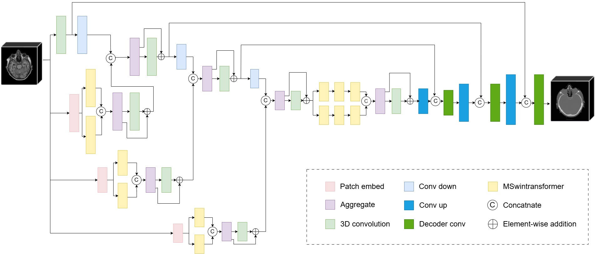
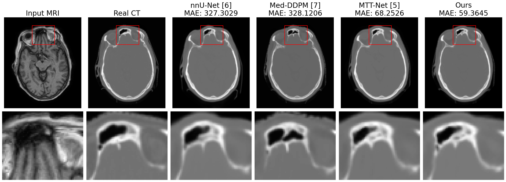

<!-- #region -->
# Med2Transformer: 3D MRI-to-CT Synthesis for MRI-Only Radiotherapy Planning

This repository contains the official PyTorch implementation of our paper, **“Parallel Swin Transformer-Enhanced 3D MRI-to-CT Synthesis for MRI-Only Radiotherapy Planning,”** including training and inference code.

The method performs 3D MRI-to-CT synthesis using a hybrid architecture that combines parallel Swin Transformer branches for global anatomical context with convolutional encoders for local detail. This design improves synthetic CT (sCT) quality, structural consistency, and reliability for MRI-only radiotherapy planning.

**Accepted to the IEEE International Symposium on Biomedical Imaging (ISBI) 2026**. The final camera-ready manuscript will appear in the conference proceedings.

---
---

## Method Overview

<p align="center">
  
</p>

**Figure 1.** Overview of the proposed Parallel Swin Transformer-Enhanced Med2Transformer architecture. Each encoder stage fuses dilated convolutional features with multi-scale shifted-window attention from parallel Swin Transformer branches. This design strengthens anatomical representation and improves MRI-to-CT correspondence in 3D volumes.

---

## Comparison of Synthesized CT Images

<p align="center">
  
</p>

**Figure 2.** Qualitative comparison of brain MRI-to-CT synthesis across baseline models and the proposed Med2Transformer. Axial samples demonstrate improved cortical bone delineation, enhanced trabecular detail, and closer structural alignment to the reference CT.

---

## Installation

Clone the repository:

```bash
git clone https://github.com/mobaidoctor/med2transformer.git
cd med2transformer
pip install -r requirements.txt
```

---

## Dataset Structure (Required)

Your dataset must follow this exact structure:

```
Task1/
 ├── brain/
 │    ├── train/
 │    ├── val/
 │    └── test/
 └── pelvis/
      ├── train/
      ├── val/
      └── test/
```

Inside each split, create one folder per patient:

```
brain/train/
 ├── BA001/
 ├── BA005/
 ├── BA012/
```

Inside every patient folder:

```
BA001/
 ├── ct.nii.gz
 ├── mr.nii.gz
 └── mask.nii.gz
```

### File description

- `mr.nii.gz`   → MRI volume  
- `ct.nii.gz`   → CT ground truth  
- `mask.nii.gz` → body or region mask  

Use `--data_root` to point to `Task1/brain` or `Task1/pelvis`.

---

## Training

### Single GPU

```bash
python3 train.py \
  --data_root ../../Task1/brain \
  --output_dir results_brain
```

### Multi-GPU (example: 4 GPUs)

```bash
torchrun --nproc_per_node=4 train.py \
  --data_root ../../Task1/brain \
  --output_dir results_brain
```

### Training Outputs

After training, the output directory will contain:

```
results_brain/
 ├── log/                     # training logs
 ├── model_checkpoints/       # saved model weights
 ├── sample_images/           # visual results during training
 ├── inference_options.txt    # saved inference configuration
 ├── results.csv              # metrics summary
 └── train_message.txt        # training messages
```

---

## Inference

Run synthesis using a trained checkpoint:

```bash
python3 inference.py \
  --input_dir ../../Task1/pelvis/test \
  --checkpoint model_pelvis.pth \
  --output_dir exports_pelvis
```

Results will be saved to:

```
exports_pelvis/
```

---
## Model Weights

Pretrained model weights are available for reproducibility and evaluation.

Download the checkpoints from [Google Drive](https://drive.google.com/drive/folders/1oUnoBVqE6z7LzQU7FdFWkjNaXpODmNPF?usp=sharing), then place them in your project directory.

Available checkpoints:

```
model_brain.pth
model_pelvis.pth
```


## Citation

If you use this code or our work, please cite:

```bibtex
@misc{dorjsembe2026parallelswintransformerenhanced3d,
  title={Parallel Swin Transformer-Enhanced 3D MRI-to-CT Synthesis for MRI-Only Radiotherapy Planning},
  author={Zolnamar Dorjsembe and Hung-Yi Chen and Furen Xiao and Hsing-Kuo Pao},
  year={2026},
  eprint={2602.05387},
  archivePrefix={arXiv},
  primaryClass={cs.CV},
  url={https://arxiv.org/abs/2602.05387}
}
```

---

## Repository Status

This repository is the official codebase for the associated manuscript and includes the complete implementation of the method.

- Training code ✓  
- Inference code ✓  
- Pretrained checkpoints ✓ 

---

## Acknowledgements

Parts of this codebase are adapted from [MTT-Net](https://github.com/SMU-MedicalVision/MTT-Net).  
We thank the authors for releasing their implementation.


## Contact

For questions or collaboration inquiries:  
[mobaidoctor@gmail.com](mailto:mobaidoctor@gmail.com)

<!-- #endregion -->
